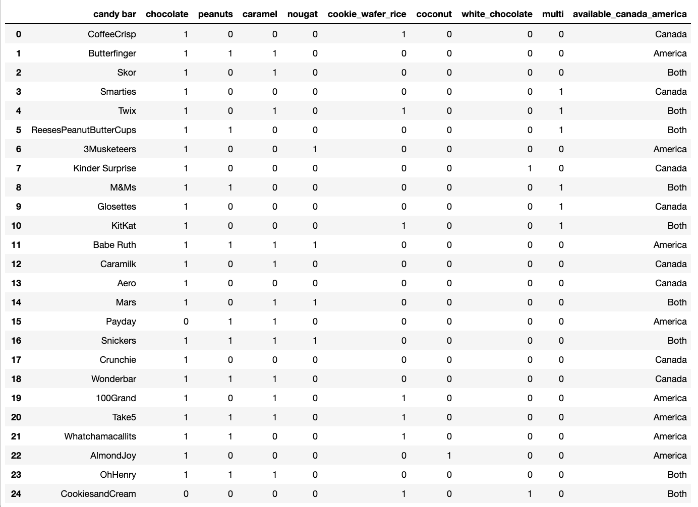
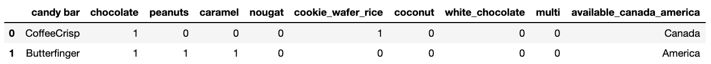
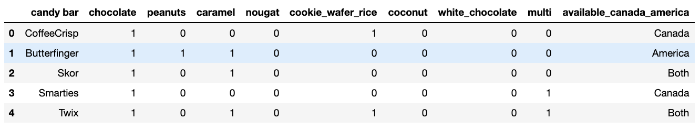

# What is a Dataframe?

When working with information, it’s important that it is stored in as
manner that is organised, readable and accessible.  
A **data frame** is a table or a 2 dimensional structure in which
**columns** contain values from a variable and **rows** are occurances,
examples or data points.

Data frames make it easy to calculate statistics and clean and store
data.

Essentially dataframe’s look like excel sheets and are a essential part
of data science.

Notes: Script here.

<html>

<audio controls >

<source src="static/placeholder_audio.mp3" />

</audio>

</html>

---

# What is Pandas and Why Do We Need It?

  
[Attribution:
GYPHY](https://giphy.com/gifs/panda-falling-vine-xTk9ZRJytbejZGlzqg)

Notes: Script here.

<html>

<audio controls >

<source src="static/placeholder_audio.mp3" />

</audio>

</html>

---

Python although a powerful tool, does not have everything we need right
away for data science. `Pandas` is an add-on python packages that
contain the tools necessary for working with and wrangling data to a
state that is functional for analysis and visualisation.


Notes: Script here.

<html>

<audio controls >

<source src="static/placeholder_audio.mp3" />

</audio>

</html>

---

## Importing Pandas

Before we really start writing any valuable code, we need to tell python
that we need our extra tools from the pandas package.

We do this by using the code below:

``` python
import pandas as pd
```

We will talk about this further on in the course, but for now, just know
that we are equiping our python base with additional abilities.

Notes: Script here.

<html>

<audio controls >

<source src="static/placeholder_audio.mp3" />

</audio>

</html>

---

## Reading in Data

Next we can bring in our data with the following code

``` python
df = pd.read_csv('data/candybars.csv')
```

let’s break this up:

`pd` : The package our tool comes from and as we said above we imported
`pandas` as `pd`.  
`read_csv()` : The tool that does the job and in this case, it is
reading in the `csv` file named `candybars.csv`.  
`df` : The dataframe is now saved as an object called `df`

Notes: Script here.

<html>

<audio controls >

<source src="static/placeholder_audio.mp3" />

</audio>

</html>

---

The object `df` looks like this:

``` python
df
```

```out
                  candy bar  chocolate  ...  multi  available_canada_america
0               CoffeeCrisp          1  ...      0                    Canada
1              Butterfinger          1  ...      0                   America
2                      Skor          1  ...      0                      Both
3                  Smarties          1  ...      1                    Canada
4                      Twix          1  ...      1                      Both
5   ReesesPeanutButterCups           1  ...      1                      Both
6               3Musketeers          1  ...      0                   America
7           Kinder Surprise          1  ...      0                    Canada
8                      M&Ms          1  ...      1                      Both
9                 Glosettes          1  ...      1                    Canada
10                   KitKat          1  ...      1                      Both
11                Babe Ruth          1  ...      0                   America
12                 Caramilk          1  ...      0                    Canada
13                     Aero          1  ...      0                    Canada
14                     Mars          1  ...      0                      Both
15                   Payday          0  ...      0                   America
16                 Snickers          1  ...      0                      Both
17                 Crunchie          1  ...      0                    Canada
18               Wonderbar           1  ...      0                    Canada
19                100Grand           1  ...      0                   America
20                    Take5          1  ...      0                   America
21         Whatchamacallits          1  ...      0                   America
22                AlmondJoy          1  ...      0                   America
23                  OhHenry          1  ...      0                      Both
24          CookiesandCream          0  ...      0                      Both

[25 rows x 10 columns]
```
``` r
?rmarkdown::knitr_options
(knitr::opts_knit$get())
```

```out
$progress
[1] TRUE

$verbose
[1] FALSE

$eval.after
[1] "fig.cap"

$base.dir
NULL

$base.url
NULL

$root.dir
NULL

$child.path
[1] ""

$upload.fun
function (x) 
x
<bytecode: 0x7fc0194e9a78>
<environment: namespace:base>

$global.device
[1] FALSE

$global.par
[1] FALSE

$concordance
[1] FALSE

$documentation
[1] 1

$self.contained
[1] TRUE

$unnamed.chunk.label
[1] "unnamed-chunk"

$highr.opts
NULL

$out.format
[1] "markdown"

$child
[1] FALSE

$parent
[1] FALSE

$tangle
[1] FALSE

$aliases
NULL

$header
highlight      tikz    framed 
       ""        ""        "" 

$global.pars
NULL

$rmarkdown.pandoc.from
[1] "markdown+autolink_bare_uris+tex_math_single_backslash"

$rmarkdown.pandoc.to
[1] "gfm"

$rmarkdown.pandoc.args
[1] "--standalone"

$rmarkdown.pandoc.id_prefix
[1] ""

$rmarkdown.keep_md
[1] FALSE

$rmarkdown.df_print
[1] "default"

$rmarkdown.version
[1] 2

$rmarkdown.runtime
[1] "static"

$output.dir
[1] "/Users/tiffany/Documents/mcl/MCL-DSCI-511-programming-in-python"
```


Notes: Script here.

<html>

<audio controls >

<source src="static/placeholder_audio.mp3" />

</audio>

</html>

---

From this database we can see that there are 25 different candybars and
10 columns. We can obtain the names of the columns using this code:

``` python
df.columns
```

``` out
Index(['candy bar', 'chocolate', 'peanuts', 'caramel', 'nougat',
       'cookie_wafer_rice', 'coconut', 'white_chocolate', 'multi',
       'available_canada_america'],
      dtype='object')
```

Or if you wanted to see the dimensions of the whole dataframe you could
code the following:

``` python
print(df.shape)
```

``` out
(25, 10)
```

Breaking up this code it just means “From our dataframe that we saved as
`df` tell me the `columns` or tell me the `shape`”.

Notes: Script here.

<html>

<audio controls >

<source src="static/placeholder_audio.mp3" />

</audio>

</html>

---

To find out the length of the dataframe, i.e. the number of rows, we can
ask for the `length`.

``` python
len(df)
```

``` out
25
```

Notice in this case we have the name of the dataframe within the `len`
brackets. That’s because `len` is a function whereas the others are
methods. This is going to be discussed later in this course. For now, be
aware that sometimes we are going to be specifying the dataframe before
the tool we are using and sometimes within it.

Notes: Script here.

<html>

<audio controls >

<source src="static/placeholder_audio.mp3" />

</audio>

</html>

---

Another important method to know is what if we don’t want to output the
whole table  
We can then specify how many rows of the dataset to show with
`df.head()`

``` python
df.head(2)
```

``` out

```

  
This specifies only 2 rows will be shown. we can specify any number of
rows within the brackets or we can leave it empty which will default to
5 rows

``` python
df.head()
```

``` out

```



Notes: Script here.

<html>

<audio controls >

<source src="static/placeholder_audio.mp3" />

</audio>

</html>

---

# let’s apply what we learned\!

Notes: Script here

<html>

<audio controls >

<source src="static/placeholder_audio.mp3" />

</audio>

</html>
